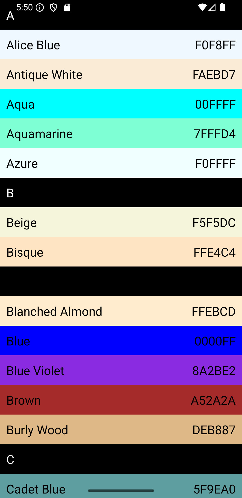
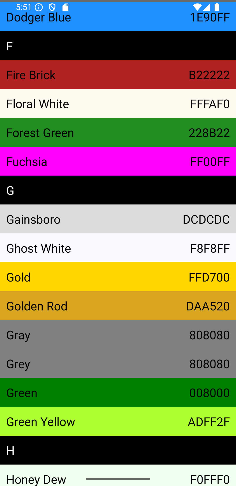

# Dictionary App
A dictionary application to allow you find definition of words and enhance your vocabulary

the technologies used in this project consist of:

1.kotlin

2.Jetpack compose 

3.Hilt

4.Flow 

5.coroutines

6.Retrofit

7.RoomDb

8.MVVM

## Demo

### Home Screen
 
